# GoYin
第六届字节跳动青训营后端极简版抖音

实现了用户功能，互动功能，社交功能，视频功能，聊天功能

## 项目特点

### 易维护

· 日志全覆盖，额外日志组件实现日志过滤，日志可视化，日志分类提取有效信息

· 可观测组件实现链路追踪，数据监控并实现可视化

· 采用微服务框架，并实现消息队列，实现结构解耦化

· 使用配置中心对配置文件进行统一管理，可进行版本回溯和监听查询

### 高可用

· k8s集群部署，实现高可拓展性

· 消息队列实现流量削峰，减小流量压力

· 实现了限流，熔断

### 高性能

· 采用kitex和hertz，高性能的微服务框架

· 适当使用并发处理减少请求时间

· 消息队列实现聊天消息处理

· 对象存储数据库存储视频和视频封面，节省了服务器资源

### 可靠性

· 敏感信息加密加盐处理

· 具备CI功能，对整体项目代码进行了高覆盖率的单元测试和性能测试

· k8s集群搭建项目，具备容错性，支持横向拓展使项目管理更加便捷，负载均衡

## 功能介绍

· 基础接口：

​		· 视频流接口

​		· 用户注册接口

​		· 用户登录接口

​		· 用户信息

​		· 视频投稿

​		· 发布列表

· 互动接口：

​		· 赞操作

​		· 喜欢列表

​		· 评论操作

​		· 视频评论操作

· 社交接口：

​		· 关系操作

​		· 用户专注操作

​		· 用户粉丝操作

​		· 用户好友列表

​		· 消息：

​			· 聊天记录

​			· 用户好友列表

### 目录结构
```
├── deployment
│   ├── GoYin-k8s
│   │   ├── api
│   │   ├── chat
│   │   ├── ingress
│   │   │   └── common
│   │   │       └── rbac
│   │   ├── intetaction
│   │   ├── sociality
│   │   ├── user
│   │   └── video
│   ├── ip_info
│   └── opentelemetry
├── docs
│   └── static
├── server
│   ├── common
│   │   ├── consts
│   │   ├── middleware
│   │   ├── test
│   │   └── tools
│   ├── idl
│   ├── kitex_gen
│   │   ├── api
│   │   │   └── apiservice
│   │   ├── base
│   │   ├── chat
│   │   │   └── chatservice
│   │   ├── errno
│   │   ├── interaction
│   │   │   └── interactionserver
│   │   ├── sociality
│   │   │   └── socialityservice
│   │   ├── user
│   │   │   └── userservice
│   │   └── video
│   │       └── videoservice
│   └── service
│       ├── api
│       │   ├── biz
│       │   │   ├── handler
│       │   │   │   └── api
│       │   │   ├── model
│       │   │   │   ├── api
│       │   │   │   └── base
│       │   │   └── router
│       │   │       └── api
│       │   ├── config
│       │   ├── initialize
│       │   │   └── rpc
│       │   ├── models
│       │   ├── pkg
│       │   └── script
│       ├── chat
│       │   ├── config
│       │   ├── dao
│       │   ├── initialize
│       │   ├── model
│       │   ├── pkg
│       │   └── script
│       ├── interaction
│       │   ├── config
│       │   ├── dao
│       │   ├── initialize
│       │   ├── model
│       │   ├── pkg
│       │   └── script
│       ├── sociality
│       │   ├── config
│       │   ├── dao
│       │   ├── initialize
│       │   ├── model
│       │   ├── pkg
│       │   └── script
│       ├── user
│       │   ├── config
│       │   ├── dao
│       │   ├── initialize
│       │   ├── model
│       │   ├── pkg
│       │   └── script
│       └── video
│           ├── config
│           ├── dao
│           ├── initialize
│           ├── model
│           ├── pkg
│           └── script
```
## 代码架构图

​		


## 技术栈

微服务框架：hertz，kitex

配置中心：nacos

服务注册中心：nacos

消息队列：nsq

数据库：mysql，redis，minio

可观测性组件：jaeger，victoria-metrics，grafana

日志组件：logstash，elasticsearch，kibana

云原生技术栈：k8s，docker，nginx-ingress

## 具体功能

### 数据库

#### mysql

运用`gorm`框架实现数据库的增删改查：


- 通过事务处理确保数据库中的数据始终保持一致和可靠，避免了数据损坏或不完整的风险。 
- 使用索引帮助数据库快速定位到符合查询条件的数据，从而避免了全表扫描的开销，提高了查询效率。
- 利用gorm本身特性并通过简单逻辑判断一定程度上减少了sql注入风险。


#### redis


#### minio


### nacos

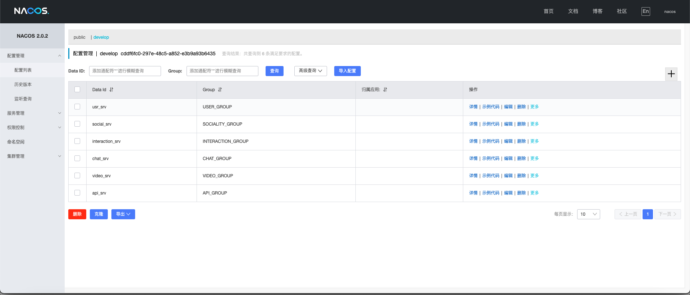

### 可观测性

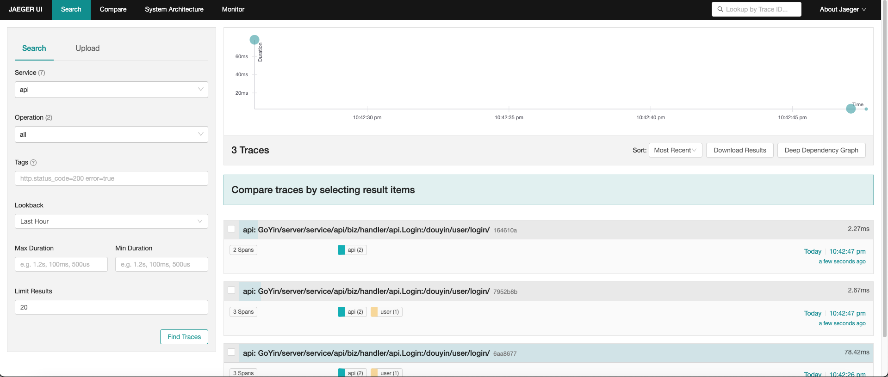


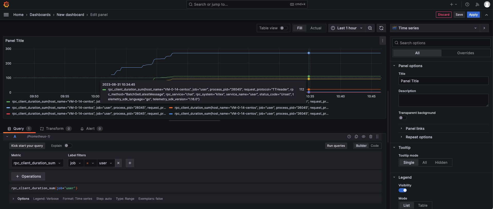

### 消息队列


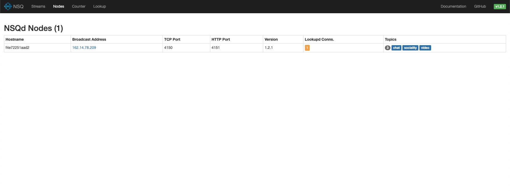


### 日志

#### Kibana实现日志可视化

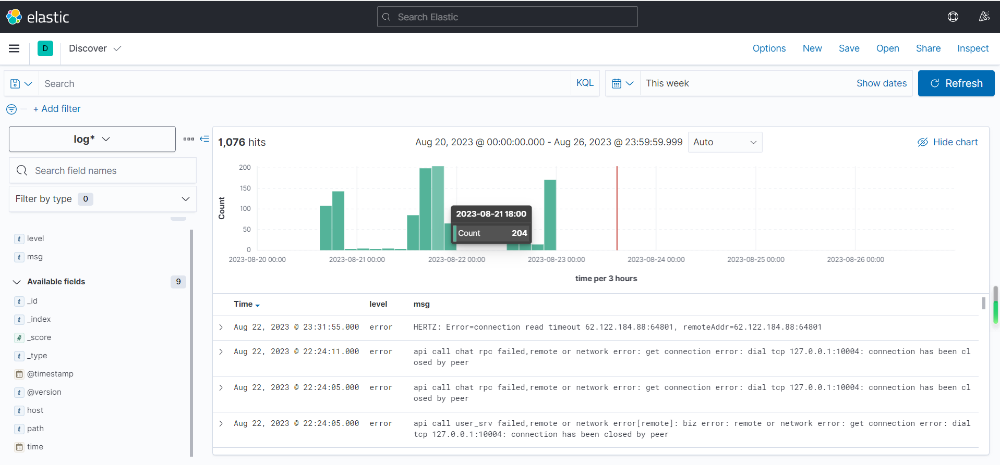

#### 查看指定错误等级日志

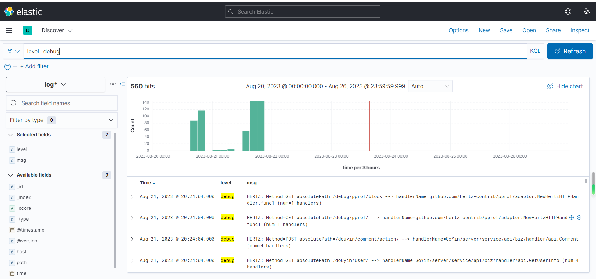

#### 根据feed流请求ip统计用户来源

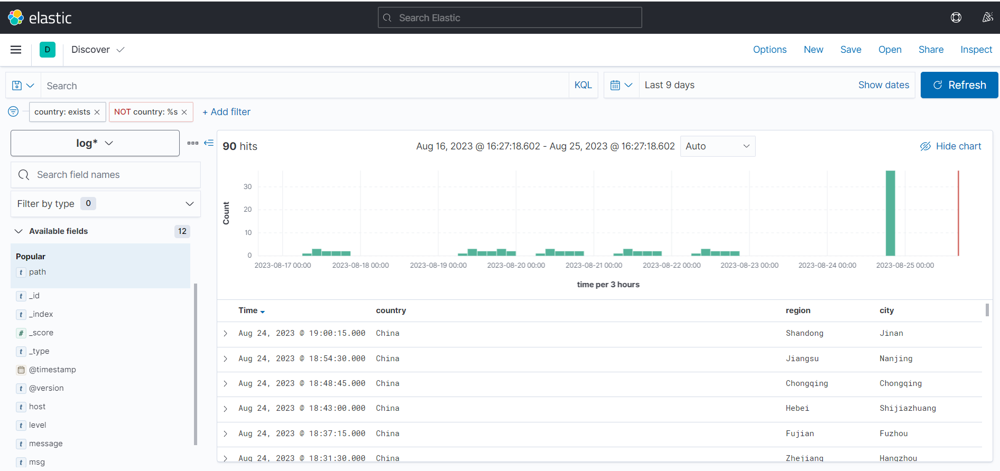

#### kibana图表面板

- 日志错误监测
- feed流每日不同时间段的请求次数
- feed流请求用户的城市top10

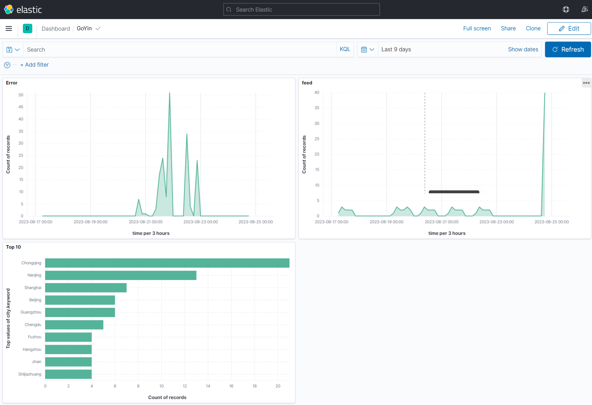


#### logstash配置文件展示

- 根据不同类型的日志信息分别映射字段
- 实时收集日志信息，重启后从头读取


### k8s

#### 步骤

##### 创建 master 节点
虚拟机内网搭建 k8s 集群

#### 创建 master 节点

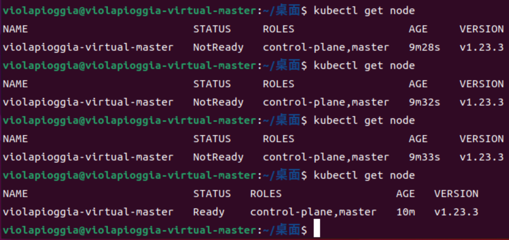

##### 创建 worker 节点并连接到 master 节点


##### 创建第一个 deployment 和 service


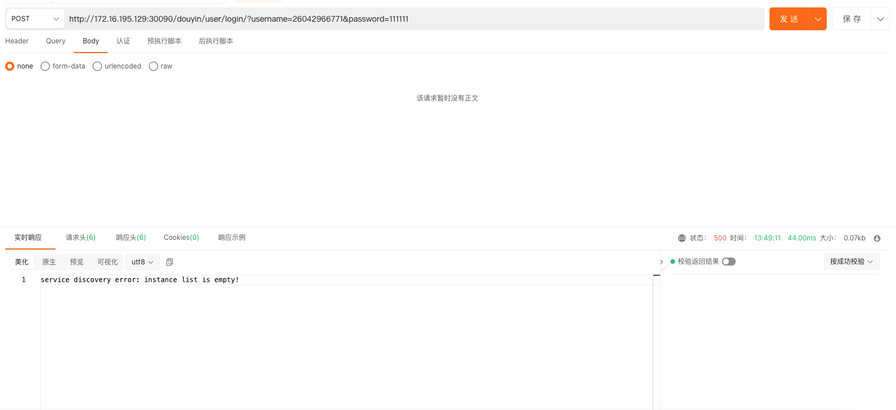

##### 创建剩下的几个服务节点

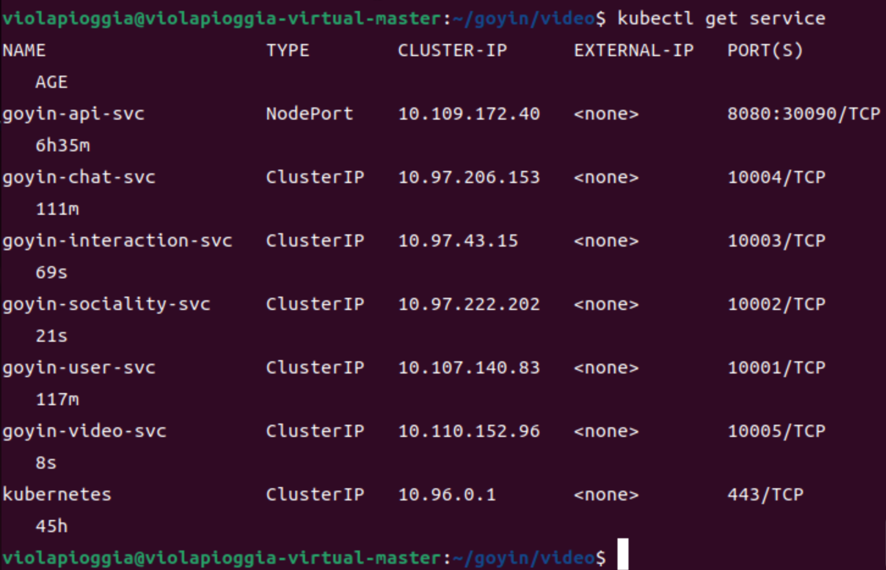

service 转发http请求成功


#### 配置 nginx-ingress


#### service+deployment部署优势
1. 服务发现和负载均衡：Service 可以将多个 Pod 组合成一个逻辑的服务，并为这个服务分配一个唯一的虚拟 IP 地址。这样，无论 Pod 的数量如何变化，服务的访问地址都保持不变，同时还可以实现负载均衡，将请求分发到不同的 Pod 上。
2. 自动伸缩：Deployment 可以根据指定的规则自动调整 Pod 的副本数量，以应对流量的增减。这样可以根据实际需求自动扩展或收缩应用程序的容量。
3. 无缝升级和回滚：Deployment 允许无缝地进行版本升级和回滚。通过逐步替换 Pod 的方式，可以确保服务在升级过程中不中断，并且在遇到问题时可以快速回滚到之前的版本。
4. 故障恢复和自愈：使用Deployment 部署的应用程序可以利用Kubernetes的自愈特性。如果某个 Pod 发生故障，Kubernetes 会自动重新创建一个新的 Pod 来替代。

## 测试

### 单元测试

对涉及 MySQL 与 Redis 的数据操作进行单元测试，为了让测试的数据不影响业务数据库，选择在 Docker 容器内进行测试。具体过程为在 Docker 中启动一个 MySQL 或 Redis 的容器，然后在容器中对数据库进行初始化并进行测试。在测试结束后会自动删除掉容器，释放容器所占用的空间。

```go
func RunMysqlInDocker(t *testing.T) (cleanUpFunc func(), db *gorm.DB, err error) {
	c, err := client.NewClientWithOpts(client.WithVersion(api.DefaultVersion))
    
	if err != nil {
		return func() {}, nil, err
	}

	ctx := context.Background()

	resp, err := c.ContainerCreate(ctx, &container.Config{
		// ...
		},
		Env: []string{ // ...},
	}, &container.HostConfig{
		PortBindings: nat.PortMap{
			// ...
		},
	}, nil, nil, "")

	if err != nil {
		return func() {}, nil, err
	}

	containerID := resp.ID

	cleanUpFunc = func() {
		err = c.ContainerRemove(ctx, containerID, types.ContainerRemoveOptions{
			Force: true,
		})
		if err != nil {
			t.Error("remove test docker failed", err)
		}
	}

	err = c.ContainerStart(ctx, containerID, types.ContainerStartOptions{})
	if err != nil {
		return cleanUpFunc, nil, err
	}

	inspRes, err := c.ContainerInspect(ctx, containerID)
	if err != nil {
		return cleanUpFunc, nil, err
	}

	hostPort := inspRes.NetworkSettings.Ports[consts.MySQLContainerPort][0]
	port, _ := strconv.Atoi(hostPort.HostPort)
	mysqlDSN := fmt.Sprintf(consts.MySqlDSN, consts.MySQLAdmin, consts.DockerTestMySQLPwd, hostPort.HostIP, port, consts.DockerTestMySQLDb)
	// Init mysql
	time.Sleep(20 * time.Second)
    
	db, err = gorm.Open(mysql.Open(mysqlDSN), &gorm.Config{
		// ...
		},
		// ...
			},
		),
	})

	// ...
}

```

逻辑为通过调用 Docker Api 在 Docker 中新建立一个 MySQL 的容器，在测试完毕后通过返回的 `cleanUpFunc` 来 自动删除容器。

在测试文件中使用表格驱动测试测试多种情况。

下面以测试 user 的 MySQL 操作为例。

```go
func TestUserLifecycleInMySQL(t *testing.T) {
	cleanUpFunc, db, err := test.RunMysqlInDocker(t)

	defer cleanUpFunc()

	if err != nil {
		t.Fatal(err)
	}

	dao := NewUser(db)

	ctx := context.Background()
    
    // ...

	cases := []struct {
		name       string
		op         func() (string, error)
		wantErr    bool
		wantResult string
	}{
        // ...
	}

	for _, cc := range cases {
		result, err := cc.op()
		if cc.wantErr {
			if err == nil {
				t.Errorf("%s:want error;got none", cc.name)
			} else {
				continue
			}
		}
		if err != nil {
			t.Errorf("%s:operation failed: %v", cc.name, err)
		}
		if result != cc.wantResult {
			t.Errorf("%s:result err: want %s,got %s", cc.name, cc.wantResult, result)
		}
	}
}
```


## 鸣谢
